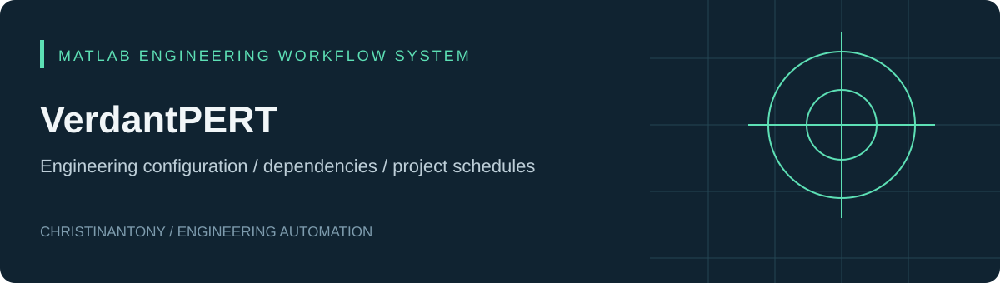
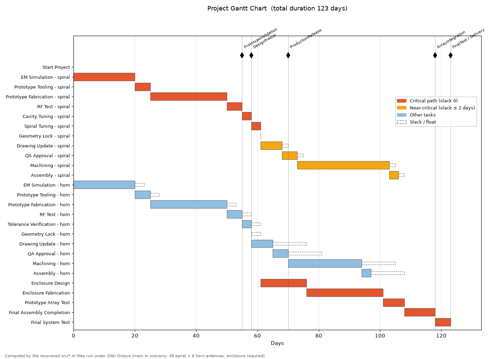
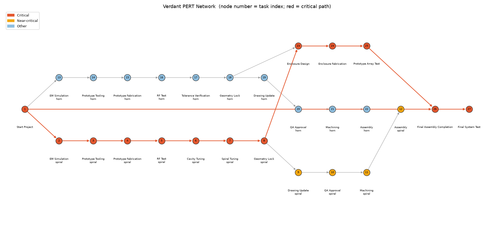
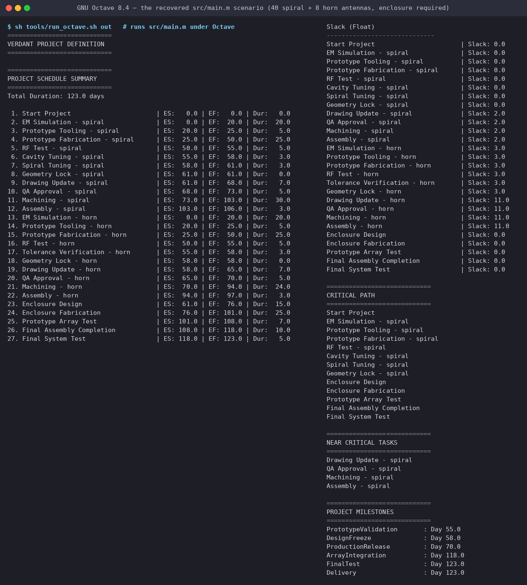
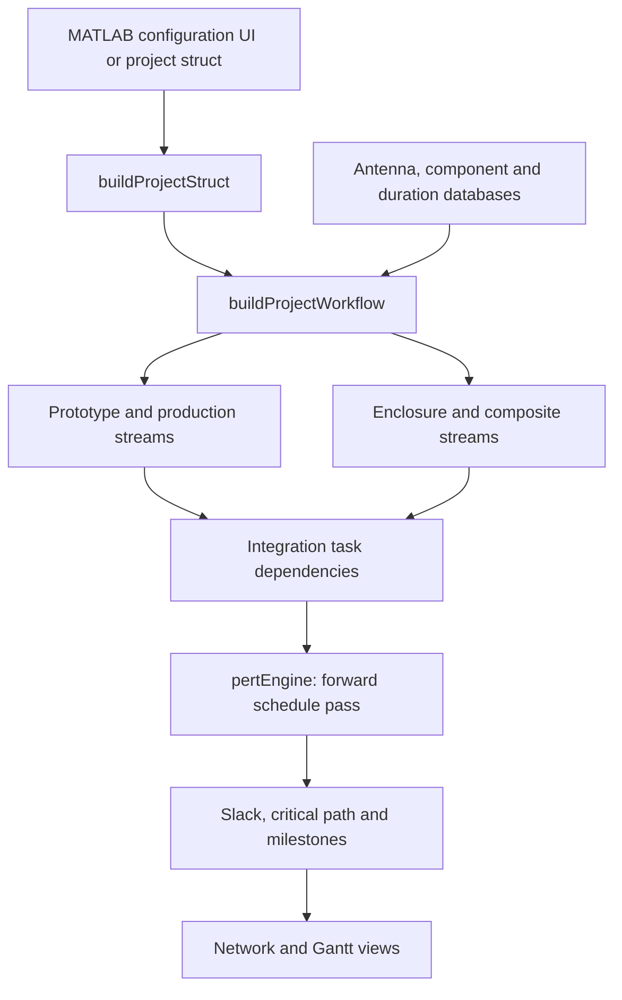

# VerdantPERT

**A MATLAB engineering-planning prototype that generates task dependencies from antenna and manufacturing configuration, then calculates schedule timing.**

Engineering projects repeat similar phases, but the dependencies change with the product, process, and quantity. VerdantPERT represents those rules as databases and modular workflow builders so a schedule can be generated from configuration.

## Implemented capabilities

- Six antenna workflow definitions: spiral, horn, biconical, conformal, blade, and planar.
- Separate prototype, production, enclosure, composite, and final-integration builders.
- Component duration models driven by quantity or vendor lead time.
- Directed task graph, topological traversal, earliest start/finish, backward-pass latest start/finish, and slack.
- Longest-path extraction, near-critical tasks with positive slack up to a default two-day threshold, and name-based milestones.
- MATLAB configuration UI, network plot, and Gantt-style visualization.

**Status:** recovered prototype with 23 MATLAB files. The console pipeline (`main.m` and everything it calls) has been executed unchanged under GNU Octave 8.4 with a small stand-in for MATLAB's `digraph`; the figures below are from that run. MATLAB itself and the `uifigure` configuration UI have not been run. Some UI controls are present without affecting scheduling; see [limitations](docs/limitations.md).

## The supplied scenario, computed

`src/main.m` defines 40 spiral and 8 horn antennas with an enclosure. Run through the recovered code, that is 27 tasks and a 123-day schedule. The critical path runs through the spiral prototype stream into the enclosure; the spiral production stream is near-critical with two days of float.







*How these were made: `tools/run_octave.sh` runs the recovered `src/*.m` files under Octave (with `tools/octave-compat/` standing in for `digraph`, `toposort`, `predecessors`, `successors`, `adjacency` and `contains`) and exports the computed schedule; `tools/plot_schedule.py` draws the Gantt and network from those numbers with the same colour rules as `main.m`. MATLAB's own graph plot and Gantt figure are not reproduced pixel for pixel. Note the milestone quirk visible in the console output: `DesignFreeze` and `ProductionRelease` take the last antenna's value (horn, day 58 and 70), since `extractMilestones` overwrites the field per antenna; see [limitations](docs/limitations.md).*

## Workflow and architecture



The console entry point computes the full reporting pipeline. The GUI entry point currently computes duration, one critical path, and plots; it does not call every console analysis module.

| Layer | Source |
| :--- | :--- |
| Application and UI | [VerdantPERTApp.m](src/VerdantPERTApp.m), [buildProjectStruct.m](src/buildProjectStruct.m) |
| Engineering rules | [getAntennaDB.m](src/getAntennaDB.m), [getComponentDB.m](src/getComponentDB.m), [getScheduleDB.m](src/getScheduleDB.m) |
| Orchestration | [buildProjectWorkflow.m](src/buildProjectWorkflow.m) and `build*Stream.m` modules |
| Timing and float | [pertEngine.m](src/pertEngine.m), [computeSlackPERT.m](src/computeSlackPERT.m) |
| Analysis and presentation | `extract*.m`, [displayPERT.m](src/displayPERT.m), [main.m](src/main.m) |

## Run in MATLAB

Download the repository and open its root folder in MATLAB. The code uses modern MATLAB UI functions and `digraph`; the minimum supported release has not been established.

```matlab
addpath(fullfile(pwd, 'src'));
app = VerdantPERTApp;  % configuration UI
```

For the supplied console scenario, run the following in a separate session if needed; `main` clears workspace variables:

```matlab
addpath(fullfile(pwd, 'src'));
main                  % 40 spiral and 8 horn antennas, enclosure required
```

The older `archive/setupVerdantPERT.m` generates different versions of key files and should not be used to initialize this repository.

### Run without MATLAB (GNU Octave)

```sh
sh tools/run_octave.sh out            # runs src/main.m, writes out/schedule.csv, edges.csv, milestones.csv, main_console.txt
python3 tools/plot_schedule.py out assets   # assets/gantt.png and assets/network.png (needs matplotlib)
```

Octave has no `digraph`; `tools/octave-compat/` provides the handful of graph calls the code makes. The plotting section at the end of `main.m` and `VerdantPERTApp.m` still need MATLAB.

## Scheduling equations

For each task `i`, `ES(i) = max(EF(predecessors))`, or zero for a root task; `EF(i) = ES(i) + duration(i)`. The backward pass uses the minimum successor latest start; `slack(i) = LS(i) - ES(i)`.

Duration models in the supplied code:

| Model | Formula |
| :--- | :--- |
| Linear | `per_unit_time × quantity` |
| Fixed | `vendor_lead_time` |
| Hybrid | `min(per_unit_time × quantity, vendor_lead_time)` |

The hybrid formula selects the shorter duration; it does not add lead time or enforce vendor capacity. Production categories use the longest component duration within each process group, implying parallel availability.

Despite the project name, this is currently **deterministic critical-path scheduling**. It does not use optimistic/most-likely/pessimistic PERT estimates or uncertainty simulation.

See the [worked scheduling example](examples/README.md), [engineering assumptions and known limitations](docs/limitations.md), and [verification record](docs/validation.md).

## Provenance and rights

The MATLAB source is the owner's supplied project, attributed to **Christinantony**, preserved byte-for-byte. Only repository layout, documentation, and clearly marked synthetic examples were added. The old setup generator is archived separately. File hashes are in [source-manifest.json](docs/source-manifest.json). No open-source license has been selected; see [rights notice](NOTICE.md).
