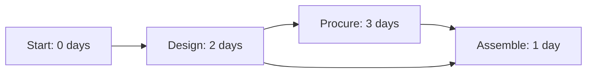

# Synthetic scheduling example

This four-task example is added portfolio material, separate from the recovered engineering scenario. The values below are calculated by hand, not captured from a MATLAB run.

| Task | Duration | Predecessors | ES | EF | LS | LF | Slack |
| :--- | ---: | :--- | ---: | ---: | ---: | ---: | ---: |
| Start | 0 | None | 0 | 0 | 0 | 0 | 0 |
| Design | 2 | Start | 0 | 2 | 0 | 2 | 0 |
| Procure | 3 | Design | 2 | 5 | 2 | 5 | 0 |
| Assemble | 1 | Design, Procure | 5 | 6 | 5 | 6 | 0 |

Expected total duration: **6 days**. Expected longest path: Start → Design → Procure → Assemble. Run `toy_schedule.m` with `src` on the MATLAB path and compare its output with this table.

The original `src/main.m` contains a larger supplied scenario: 40 spiral antennas, 8 horn antennas, and an enclosure. Its runtime duration is not asserted here.
